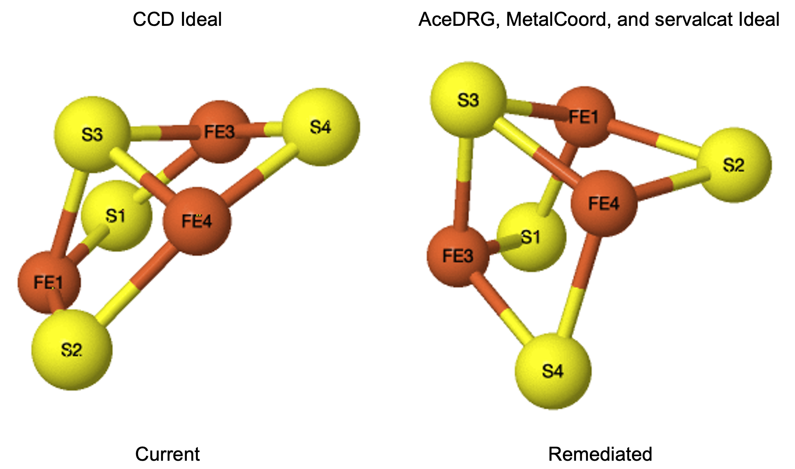
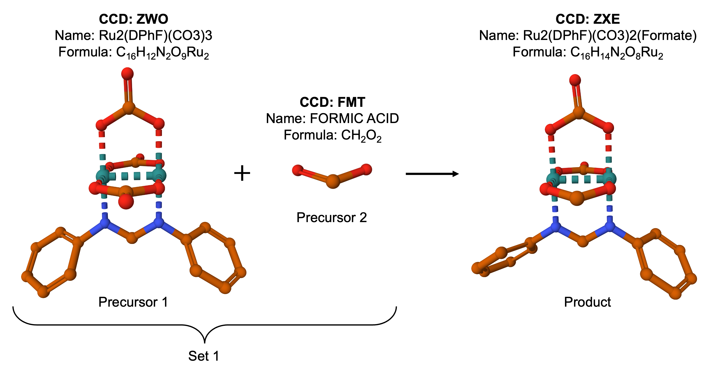

# Metalloprotein Remediation

## Sections

- [Introduction](#introduction)
- [Scope](#scope)
- [Corrections](#corrections)
- [Enhanced Annotation](#enhanced-annotation)
- [Example Enhanced Annotation in CCD Files](#example-enhanced-annotation-in-ccd-files)
- [Example Enhanced Annotation in Coordinate Files](#example-enhanced-annotation-in-coordinate-files)
- [References](#references)
- [Acknowledgements](#acknowledgements)

## Introduction
Toward the goal of sustaining Core Archives of biostructure data and metadata to promote basic and applied research and education, the wwPDB strives to make biostructure data Findable, Accessible, Interoperable and Reusable (FAIR). Owing to unique properties of metals, the standard software and procedures developed for organic compounds do not always provide accurate data on metal-containing compounds, which poses major obstacles for data reusability. Further, the metalloprotein research community has expressed a need for enhanced metal annotation, which would support findability and reusability of metalloprotein data. Based on identification of issues that could lead to widespread error propagation and on feedback from the community, metalloproteins were identified as a target for improvement ("remediation").
To improve accuracy and enhance annotation, a new data model for metalloproteins has been developed in consultation with the metalloprotein research community. In addition to providing valuable feedback, the metalloprotein research community serves a crucial role in this remediation by providing tools that enable error correction as well as enhanced annotation of metalloproteins.

## Scope
For this project, the ~900 metal-containing CCDs (80 metal ions and ~820 polyatomic metal chemical components) will be remediated. The focus of the remediation is on polyatomic metal chemical components, which tend to have more challenges in their definition and representation compared to metal ions. Among entries, the ~13,000 entries containing polyatomic metal chemical components will be remediated. Entries containing metal ions are out of scope.

## Corrections
As a key step of the remediation, Chemical Component Dictionary (CCD) files will be corrected as needed to ensure data accuracy and reusability. The following corrections will be completed:
- Standardization of charge on metals and metal-coordinating atoms.
- Generation of proper ideal coordinates for metal-containing chemical components.
- Splitting or merging metal-containing chemical components where required if: 
  - for splitting, the metal is not part of a standalone coordination compound.
  - for merging, the metal coordination is more complete upon merging two components.
- Corrections of inaccuracies in the definition (such as incorrect bond order or missing hydrogens).
Providing such corrections is crucial for mitigating error propagation. For instance, if the PDB provides incorrect ideal coordinates in our CCD, these are then reused in future structures, leading to incorrect geometries in new depositions (see CCD F3S example in Figure 1 below).



Figure 1: Ideal coordinate updates for CCD F3S. Left, ideal coordinates as currently defined in the CCD, with highly distorted angles. Right, updated ideal coordinates using AceDRG, MetalCoord, and servalcat software, with proper angles being slightly obtuse for S-Fe-S (~105 degrees) and acute for Fe-S-Fe (~75 degrees).

## Enhanced Annotation
Enhanced annotations in the CCD files include:
- For metal ions and polyatomic metal chemical components:
  - Indicating the component type (metal cation or metal-containing ligand).
- For polyatomic metal chemical components only:
  - Precursor annotation (for compounds with two or more leaving atoms, or a bond order change).
  - Adopting metalloprotein community software for metal coordination annotation (coordination number, coordination geometry, and coordination descriptor).
  - Annotation of metal-protein interaction.
  - Flagging metal coordination and metal-pi bonds.

Enhanced annotations in the coordinate files include:
- Adopting metalloprotein community software for metal coordination annotation (coordination number, coordination geometry, and coordination descriptor).
- Annotation of metal-protein interaction.
- Author-provided oxidation state or group charge.
- Author-provided supporting evidence for metalloprotein features (metal identity, coordination, oxidation state, group charge).

## Example Enhanced Annotation in CCD Files
### Example of component type
The component type annotation will be included in the chem_comp category as shown in the example below for chemical component HEM.
```
#
_chem_comp.id                      HEM
…
_chem_comp.pdbx_comp_type          "metal-containing ligand"
#
```

### Example of precursor
The precursor annotation will involve new categories as shown in the example below for chemical component ZXE. The two precursors are ZWO and FMT (see Figure 2).



Figure 2: Diruthenium paddlewheel complex ZWO and formate are precursors of another diruthenium paddlewheel complex, ZXE.

```
# 
_pdbx_chem_comp_precursor_set.id        1 
_pdbx_chem_comp_precursor_set.class     substitution 
_pdbx_chem_comp_precursor_set.details   'Formate from the crystal condition displaces one CO3 of ZWO' 
# 
loop_
_pdbx_chem_comp_precursor.id 
_pdbx_chem_comp_precursor.comp_id 
_pdbx_chem_comp_precursor.set_id 
_pdbx_chem_comp_precursor.precursor_comp_id 
_pdbx_chem_comp_precursor.formula 
_pdbx_chem_comp_precursor.details 
1 ZXE 1 ZWO 'C16 H12 N2 O9 Ru2' 'One CO3 is displaced by formate'         
2 ZXE 1 FMT 'C H2 O2'           'Formate binds both Ru and displaces CO3' 
# 
loop_
_pdbx_chem_comp_precursor_descriptor.ordinal 
_pdbx_chem_comp_precursor_descriptor.comp_id 
_pdbx_chem_comp_precursor_descriptor.precursor_id 
_pdbx_chem_comp_precursor_descriptor.type 
_pdbx_chem_comp_precursor_descriptor.descriptor 
_pdbx_chem_comp_precursor_descriptor.source 
_pdbx_chem_comp_precursor_descriptor.source_version 
_pdbx_chem_comp_precursor_descriptor.program 
_pdbx_chem_comp_precursor_descriptor.program_version 
1  ZXE 1 InChI            'InChI=1S/C13H12N2.3CH2O3.2Ru/c1-3-7-12(8-4-1)14-11-15-13-9-5-2-6-10-13;3*2-1(3)4;;/h1-10H,11H2;3*(H2,2,3,4);;/q-2;;;;2*+4/p-6' ? ? InChI                1.06  
2  ZXE 1 InChIKey         TZCHHEUOTVFLIC-UHFFFAOYSA-H                                                                                                     ? ? InChI                1.06  
3  ZXE 1 SMILES_CANONICAL 'O=C1O[Ru]23OC(=O)O[Ru](O1)(OC(=O)O2)N(CN3c4ccccc4)c5ccccc5'                                                                    ? ? CACTVS               3.385 
4  ZXE 1 SMILES           'O=C1O[Ru]23OC(=O)O[Ru](O1)(OC(=O)O2)N(CN3c4ccccc4)c5ccccc5'                                                                    ? ? CACTVS               3.385 
5  ZXE 1 SMILES_CANONICAL 'c1ccc(cc1)N2CN([Ru]345[Ru]2(OC(=O)O3)(OC(=O)O4)OC(=O)O5)c6ccccc6'                                                              ? ? 'OpenEye OEToolkits' 2.0.7 
6  ZXE 1 SMILES           'c1ccc(cc1)N2CN([Ru]345[Ru]2(OC(=O)O3)(OC(=O)O4)OC(=O)O5)c6ccccc6'                                                              ? ? 'OpenEye OEToolkits' 2.0.7 
7  ZXE 2 SMILES           O=CO                                                                                                                            ? ? ACDLabs              11.02 
8  ZXE 2 SMILES_CANONICAL OC=O                                                                                                                            ? ? CACTVS               3.352 
9  ZXE 2 SMILES           OC=O                                                                                                                            ? ? CACTVS               3.352 
10 ZXE 2 SMILES_CANONICAL 'C(=O)O'                                                                                                                        ? ? 'OpenEye OEToolkits' 1.7.0 
11 ZXE 2 SMILES           'C(=O)O'                                                                                                                        ? ? 'OpenEye OEToolkits' 1.7.0 
12 ZXE 2 InChI            'InChI=1S/CH2O2/c2-1-3/h1H,(H,2,3)'                                                                                             ? ? InChI                1.03  
13 ZXE 2 InChIKey         BDAGIHXWWSANSR-UHFFFAOYSA-N                                                                                                     ? ? InChI                1.03  
# 
loop_
_pdbx_chem_comp_precursor_identifier.ordinal 
_pdbx_chem_comp_precursor_identifier.comp_id 
_pdbx_chem_comp_precursor_identifier.precursor_id 
_pdbx_chem_comp_precursor_identifier.type 
_pdbx_chem_comp_precursor_identifier.identifier 
_pdbx_chem_comp_precursor_identifier.source 
_pdbx_chem_comp_precursor_identifier.source_version 
_pdbx_chem_comp_precursor_identifier.program 
_pdbx_chem_comp_precursor_identifier.program_version 
1 ZXE 2 'SYSTEMATIC NAME' 'formic acid'    ? ? ACDLabs              11.02 
2 ZXE 2 'SYSTEMATIC NAME' 'methanoic acid' ? ? 'OpenEye OEToolkits' 1.6.1 
# 
```
### Example of metal coordination annotation
Metal coordination is assessed using community software on a per-atom basis at the instance level, to give a complete picture of all coordination partners (protein, nucleic acid, small molecule, water, etc) and the coordination geometry. The coordination descriptor delineates coordination partners and angles that make up the coordination geometry. In the coordination descriptor, the metal is listed first, followed by each coordinating atom in parentheses. Within curly brackets, all angles that allow reconstruction of the primary metal coordination sphere are listed. When there are multiple possible coordination numbers, coordination geometries, or coordination descriptors (due to different possible coordination partners), the different options will be annotated. Annotation will be populated in the pdbx_chem_comp_atom_feature category as shown in the example below for chemical component 1PT. 
```
#
loop_
_pdbx_chem_comp_atom_feature.ordinal
_pdbx_chem_comp_atom_feature.id
_pdbx_chem_comp_atom_feature.comp_id
_pdbx_chem_comp_atom_feature.atom_id
_pdbx_chem_comp_atom_feature.type
_pdbx_chem_comp_atom_feature.value
_pdbx_chem_comp_atom_feature.provenance
1  1 1PT PT 'Coordination number'     4                                                                         FindGeo    
2  1 1PT PT 'Coordination geometry'   'square plane'                                                            FindGeo    
3  1 1PT PT 'Coordination descriptor' 'Pt(N)(N)(N)(N){NPtN<90>,NPtN<180>,NPtN<90>,NPtN<90>,NPtN<180>,NPtN<90>}' PDB        
4  2 1PT PT 'Coordination number'     4                                                                         FindGeo    
5  2 1PT PT 'Coordination geometry'   'square plane'                                                            FindGeo    
6  2 1PT PT 'Coordination descriptor' 'Pt(N)(N)(N)(O){NPtN<90>,NPtN<180>,NPtO<90>,NPtN<90>,NPtO<180>,NPtO<90>}' PDB        
7  3 1PT PT 'Coordination number'     4                                                                         FindGeo    
8  3 1PT PT 'Coordination geometry'   'square plane'                                                            FindGeo    
9  3 1PT PT 'Coordination descriptor' 'Pt(N)(N)(O)(O){NPtN<90>,NPtO<180>,NPtO<90>,NPtO<90>,NPtO<180>,OPtO<90>}' PDB        
10 4 1PT PT 'Coordination number'     4                                                                         FindGeo    
11 4 1PT PT 'Coordination geometry'   'square plane'                                                            FindGeo    
12 4 1PT PT 'Coordination descriptor' 'Pt(N)(N)(O)(S){NPtN<90>,NPtO<180>,NPtS<90>,NPtO<90>,NPtS<180>,OPtS<90>}' PDB        
13 5 1PT PT 'Coordination number'     4                                                                         MetalCoord 
14 5 1PT PT 'Coordination geometry'   square-planar                                                             MetalCoord 
15 5 1PT PT 'Coordination descriptor' 'Pt(N)(N)(N)(N){NPtN<90>,NPtN<180>,NPtN<90>,NPtN<90>,NPtN<180>,NPtN<90>}' PDB        
16 6 1PT PT 'Coordination number'     4                                                                         MetalCoord 
17 6 1PT PT 'Coordination geometry'   square-planar                                                             MetalCoord 
18 6 1PT PT 'Coordination descriptor' 'Pt(N)(N)(N)(O){NPtN<90>,NPtN<180>,NPtO<90>,NPtN<90>,NPtO<180>,NPtO<90>}' PDB        
19 7 1PT PT 'Coordination number'     4                                                                         MetalCoord 
20 7 1PT PT 'Coordination geometry'   square-planar                                                             MetalCoord 
21 7 1PT PT 'Coordination descriptor' 'Pt(N)(N)(O)(O){NPtN<90>,NPtO<180>,NPtO<90>,NPtO<90>,NPtO<180>,OPtO<90>}' PDB        
22 8 1PT PT 'Coordination number'     4                                                                         MetalCoord 
23 8 1PT PT 'Coordination geometry'   square-planar                                                             MetalCoord 
24 8 1PT PT 'Coordination descriptor' 'Pt(N)(N)(O)(S){NPtN<90>,NPtO<180>,NPtS<90>,NPtO<90>,NPtS<180>,OPtS<90>}' PDB        
#
```
### Example of protein-metal interaction
Metal-protein interactions will be annotated in the pdbx_chem_comp_pcm category as shown in the example below for chemical component SF4.
```
#
loop_
_pdbx_chem_comp_pcm.pcm_id                                       
_pdbx_chem_comp_pcm.comp_id                          
_pdbx_chem_comp_pcm.modified_residue_id
_pdbx_chem_comp_pcm.type                                            
_pdbx_chem_comp_pcm.category                                     
_pdbx_chem_comp_pcm.position                           
_pdbx_chem_comp_pcm.polypeptide_position
_pdbx_chem_comp_pcm.comp_id_linking_atom
_pdbx_chem_comp_pcm.modified_residue_id_linking_atom
_pdbx_chem_comp_pcm.uniprot_specific_ptm_accession
_pdbx_chem_comp_pcm.uniprot_generic_ptm_accession
1  SF4 ASP None "Metal coordination" "Amino-acid side chain" "Any position" "FE2" "OD1" ? ?
2  SF4 ASP None "Metal coordination" "Amino-acid side chain" "Any position" "FE2" "OD2" ? ?
3  SF4 ASP None "Metal coordination" "Amino-acid side chain" "Any position" "FE3" "OD1" ? ?
4  SF4 ASP None "Metal coordination" "Amino-acid side chain" "Any position" "FE3" "OD2" ? ?
5  SF4 ASP None "Metal coordination" "Amino-acid side chain" "Any position" "FE4" "OD1" ? ?
6  SF4 ASP None "Metal coordination" "Amino-acid side chain" "Any position" "FE4" "OD2" ? ?
7  SF4 CYS None "Metal coordination" "Amino-acid side chain" "Any position" "FE1" "SG"  ? ?
8  SF4 CYS None "Metal coordination" "Amino-acid side chain" "Any position" "FE2" "SG"  ? ?
9  SF4 CYS None "Metal coordination" "Amino-acid side chain" "Any position" "FE3" "SG"  ? ?
10 SF4 CYS None "Metal coordination" "Amino-acid side chain" "Any position" "FE4" "SG"  ? ?
11 SF4 GLN None "Metal coordination" "Amino-acid side chain" "Any position" "FE1" "NE2" ? ?
12 SF4 GLN None "Metal coordination" "Amino-acid side chain" "Any position" "FE1" "OE1" ? ?
13 SF4 GLN None "Metal coordination" "Amino-acid side chain" "Any position" "FE3" "OE1" ? ?
15 SF4 GLU None "Metal coordination" "Amino-acid side chain" "Any position" "FE2" "OE1" ? ?
16 SF4 GLU None "Metal coordination" "Amino-acid side chain" "Any position" "FE3" "OE1" ? ?
17 SF4 GLU None "Metal coordination" "Amino-acid side chain" "Any position" "FE3" "OE2" ? ?
18 SF4 GLU None "Metal coordination" "Amino-acid side chain" "Any position" "FE4" "OE2" ? ?
19 SF4 HIS None "Metal coordination" "Amino-acid side chain" "Any position" "FE1" "ND1" ? ?
20 SF4 HIS None "Metal coordination" "Amino-acid side chain" "Any position" "FE1" "NE2" ? ?
21 SF4 HIS None "Metal coordination" "Amino-acid side chain" "Any position" "FE2" "ND1" ? ?
22 SF4 HIS None "Metal coordination" "Amino-acid side chain" "Any position" "FE2" "NE2" ? ?
23 SF4 HIS None "Metal coordination" "Amino-acid side chain" "Any position" "FE3" "ND1" ? ?
24 SF4 HIS None "Metal coordination" "Amino-acid side chain" "Any position" "FE3" "NE2" ? ?
25 SF4 HIS None "Metal coordination" "Amino-acid side chain" "Any position" "FE4" "ND1" ? ?
26 SF4 HIS None "Metal coordination" "Amino-acid side chain" "Any position" "FE4" "NE2" ? ?
27 SF4 SER None "Metal coordination" "Amino-acid side chain" "Any position" "FE4" "OG"  ? ?
28 SF4 TYR None "Metal coordination" "Amino-acid side chain" "Any position" "FE1" "OG"  ? ?
29 SF4 HIS None "Metal coordination" "Amino-acid side chain" "Any position" "FE3" "OG"  ? ?
#
```
### Examples of metal coordination and metal-pi bond flags
For metal coordination and metal-pi bonds, new flags will be introduced in the chem_comp_bond category. The metal coordination flag will be used for all metal-nonmetal bonds, whereas the metal-pi bond flag will be used only when the bond between a metal and a pi system. See examples below for SF4 and RUC.
```
#
loop_
_chem_comp_bond.comp_id
_chem_comp_bond.atom_id_1
_chem_comp_bond.atom_id_2
_chem_comp_bond.value_order
_chem_comp_bond.pdbx_aromatic_flag
_chem_comp_bond.pdbx_stereo_config
_chem_comp_bond.pdbx_metal_coordination_flag
_chem_comp_bond.pdbx_metal_pi_flag
_chem_comp_bond.pdbx_ordinal
SF4 FE1 S2 SING N N Y N 1 
SF4 FE1 S3 SING N N Y N 2 
SF4 FE1 S4 SING N N Y N 3 
SF4 FE2 S1 SING N N Y N 4 
SF4 FE2 S3 SING N N Y N 5 
SF4 FE2 S4 SING N N Y N 6 
SF4 FE3 S1 SING N N Y N 7 
SF4 FE3 S2 SING N N Y N 8 
SF4 FE3 S4 SING N N Y N 9 
SF4 FE4 S1 SING N N Y N 10
SF4 FE4 S2 SING N N Y N 11
SF4 FE4 S3 SING N N Y N 12
#
loop_
_chem_comp_bond.comp_id
_chem_comp_bond.atom_id_1
_chem_comp_bond.atom_id_2
_chem_comp_bond.value_order
_chem_comp_bond.pdbx_aromatic_flag
_chem_comp_bond.pdbx_stereo_config
_chem_comp_bond.pdbx_metal_coordination_flag
_chem_comp_bond.pdbx_metal_pi_flag
_chem_comp_bond.pdbx_ordinal
RUC C29  C30 DOUB N N N N 1 
RUC C29  C28 SING N N N N 2 
RUC C30  C31 SING N N N N 3 
RUC C31  C26 DOUB N N N N 4 
RUC C26  C27 SING N N N N 5 
RUC C27  C28 DOUB N N N N 6 
RUC C29  H29 SING N N N N 7 
RUC C30  H30 SING N N N N 8 
RUC C31  H31 SING N N N N 9 
RUC C26  H26 SING N N N N 10
RUC C27  H27 SING N N N N 11
RUC C28  H28 SING N N N N 12
RUC RU11 C29 SING N N Y Y 13
RUC RU11 C30 SING N N Y Y 14
RUC RU11 C31 SING N N Y Y 15
RUC RU11 C26 SING N N Y Y 16
RUC RU11 C27 SING N N Y Y 17
RUC RU11 C28 SING N N Y Y 18
#
```
## Example Enhanced Annotation in Coordinate Files
### Example of metal coordination annotation
For the coordinate files, metal coordination will be assessed using community software and compared with the coordination annotation in the CCD (if available) to determine if the coordination geometry is 'expected' (matching with the CCD) or 'unexpected' (not matching with the CCD). See example below for 1pg9, an entry containing chemical component 1PT.
```
#
loop_
_pdbx_nonpoly_atom_feature.ordinal
_pdbx_nonpoly_atom_feature.comp_id
_pdbx_nonpoly_atom_feature.atom_id
_pdbx_nonpoly_atom_feature.label_asym_id
_pdbx_nonpoly_atom_feature.type
_pdbx_nonpoly_atom_feature.value
_pdbx_nonpoly_atom_feature.provenance
_pdbx_nonpoly_atom_feature.assessment
1 1PT PT C 'Coordination number'     4                                                                         FindGeo    ?        
2 1PT PT C 'Coordination geometry'   'square plane (regular)'                                                  FindGeo    Expected 
3 1PT PT C 'Coordination descriptor' 'Pt(N)(N)(N)(N){NPtN<90>,NPtN<180>,NPtN<90>,NPtN<90>,NPtN<180>,NPtN<90>}' PDB        ?        
4 1PT PT C 'Coordination number'     4                                                                         MetalCoord ?        
5 1PT PT C 'Coordination geometry'   square-planar                                                             MetalCoord Expected 
6 1PT PT C 'Coordination descriptor' 'Pt(N)(N)(N)(N){NPtN<90>,NPtN<180>,NPtN<90>,NPtN<90>,NPtN<180>,NPtN<90>}' PDB        ?        
#
```
### Example of protein-metal interaction
In coordinate files, metal-protein interactions will be annotated in the pdbx_modification_feature category as shown in the example below for chemical component 5wqq, an entry containing chemical component SF4.
```
#
loop_
_pdbx_modification_feature.ordinal
_pdbx_modification_feature.label_comp_id
_pdbx_modification_feature.label_asym_id
_pdbx_modification_feature.label_seq_id
_pdbx_modification_feature.label_alt_id
_pdbx_modification_feature.modified_residue_label_comp_id
_pdbx_modification_feature.modified_residue_label_asym_id
_pdbx_modification_feature.modified_residue_label_seq_id
_pdbx_modification_feature.modified_residue_label_alt_id
_pdbx_modification_feature.auth_comp_id
_pdbx_modification_feature.auth_asym_id
_pdbx_modification_feature.auth_seq_id
_pdbx_modification_feature.PDB_ins_code
_pdbx_modification_feature.symmetry
_pdbx_modification_feature.modified_residue_auth_comp_id
_pdbx_modification_feature.modified_residue_auth_asym_id
_pdbx_modification_feature.modified_residue_auth_seq_id
_pdbx_modification_feature.modified_residue_PDB_ins_code
_pdbx_modification_feature.modified_residue_symmetry
_pdbx_modification_feature.comp_id_linking_atom
_pdbx_modification_feature.modified_residue_id_linking_atom
_pdbx_modification_feature.modified_residue_id
_pdbx_modification_feature.ref_pcm_id
_pdbx_modification_feature.ref_comp_id
_pdbx_modification_feature.type
_pdbx_modification_feature.category
1 SF4 B . ? CYS A 43 ? SF4 A 101 ? 1_555 CYS A 43 ? 1_555 FE1 SG CYS 7  SF4 None 'Metal coordination'
2 SF4 B . ? CYS A 46 ? SF4 A 101 ? 1_555 CYS A 46 ? 1_555 FE2 SG CYS 8  SF4 None 'Metal coordination'
3 SF4 B . ? CYS A 61 ? SF4 A 101 ? 1_555 CYS A 61 ? 1_555 FE3 SG CYS 9  SF4 None 'Metal coordination'
4 SF4 B . ? CYS A 75 ? SF4 A 101 ? 1_555 CYS A 75 ? 1_555 FE4 SG CYS 10 SF4 None 'Metal coordination'
#
```
### Author-provided oxidation state or group charge
Oxidation state (for mononuclear metal chemical components) and group charge (for polynuclear chemical components) will be collected from depositors. As oxidation state is an atom-level feature, it will be populated in the pdbx_nonpoly_atom_feature category. See oxidation state example below for 1pg9, an entry containing chemical component 1PT.
```
#
loop_
_pdbx_nonpoly_atom_feature.ordinal
_pdbx_nonpoly_atom_feature.comp_id
_pdbx_nonpoly_atom_feature.atom_id
_pdbx_nonpoly_atom_feature.label_asym_id
_pdbx_nonpoly_atom_feature.type
_pdbx_nonpoly_atom_feature.value
_pdbx_nonpoly_atom_feature.provenance
_pdbx_nonpoly_atom_feature.assessment
1 1PT PT C 'Oxidation state' 2 Author ?
#
```
Since group charge is a chemical component-level feature, it will be populated in the pdbx_nonpoly _feature category. See group charge example below for 5wqq, an entry containing chemical component SF4.
```
#
loop_
_pdbx_nonpoly_feature.ordinal
_pdbx_nonpoly_feature.comp_id
_pdbx_nonpoly_feature.label_asym_id
_pdbx_nonpoly_feature.type
_pdbx_nonpoly_feature.value
_pdbx_nonpoly_feature.provenance
1 SF4 B 'Group charge' 3 Author
#
```
### Author-provided supporting evidence for metal features
Supporting evidence will be collected at the atom-level for metal identity, coordination number, coordination geometry, and oxidation state in a category called pdbx_nonpoly_atom_feature_evidence. Example evidence for oxidation state is shown below for the 1pg9 entry.
```
#
loop_
_pdbx_nonpoly_atom_feature_evidence.ordinal
_pdbx_nonpoly_atom_feature_evidence.comp_id
_pdbx_nonpoly_atom_feature_evidence.atom_id
_pdbx_nonpoly_atom_feature_evidence.label_asym_id
_pdbx_nonpoly_atom_feature_evidence.type
_pdbx_nonpoly_atom_feature_evidence.experimental_support
_pdbx_nonpoly_atom_feature_evidence.details
1 1PT PT C 'Oxidation state' 'X-ray absorption spectroscopy' ?
#
```
For group charge, supporting evidence will be collected at the chemical component-level in a category called pdbx_nonpoly_ feature_evidence. Example evidence for group charge is shown below for the 5wqq entry.
```
#
loop_
_pdbx_nonpoly_feature_evidence.ordinal
_pdbx_nonpoly_feature_evidence.comp_id
_pdbx_nonpoly_feature_evidence.label_asym_id
_pdbx_nonpoly_feature_evidence.type
_pdbx_nonpoly_feature_evidence.experimental_support
_pdbx_nonpoly_feature_evidence.details
1 SF4 B 'Group charge' 'UV-Vis spectroscopy' ?
#
```
## References
[FindGeo](https://metalweb.cerm.unifi.it/tools/findgeo_help/): Andreini C, Cavallaro G, Lorenzini S. FindGeo: a tool for determining metal coordination geometry. Bioinformatics 2012, 28(12), 1658-1660.

[MetalCoord](https://github.com/Lekaveh/MetalCoordAnalysis): Babai, KH, Long, F, Malý M, Yamashita K, Murshudov GN. Improving macromolecular structure refinement with metal-coordination restraints. Acta Crystallogr D Biol Crystallogr 2024, D80, 821-833.

## Acknowledgements
The metalloprotein remediation project is a wwPDB collaborative project that is carried out principally by [RCSB PDB](https://rcsb.org/) at Rutgers, The State University of New Jersey and is funded by the U.S. National Science Foundation (DBI-2321666), the US Department of Energy (DE-SC0019749), and the National Cancer Institute, National Institute of Allergy and Infectious Diseases, and National Institute of General Medical Sciences of the National Institutes of Health under grant R01GM157729.
